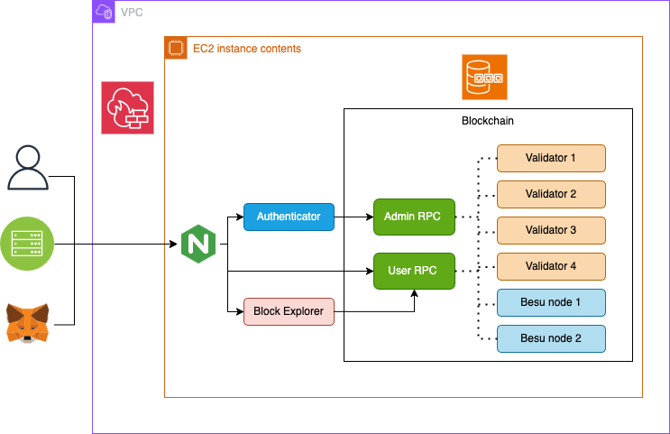

# Besu Dev Starter

## **Important**
For this repository work properly the `env` file must be renamed and `.example` extension must be removed.
For security reasons, the original env files were not versioned.

The following env files needs to be renamed:

- `.env.example` (in the project's base path)
- `quorum-explorer/env.example` 
- `config/besu/.env.example`

To run this project in production, other files need to be removed from git, like Besu members keys.

## Table of Contents

- [Besu Dev Starter](#besu-dev-starter)
  - [**Important**](#important)
  - [Table of Contents](#table-of-contents)
  - [Prerequisites](#prerequisites)
  - [Usage](#usage)
  - [Dev Network Setups](#dev-network-setups)
    - [i. Proof of Authority (POA) Network ](#i-proof-of-authority-poa-network-)
    - [ii. POA Network with Privacy ](#ii-poa-network-with-privacy-)
    - [iii. Smart Contracts \& DApps ](#iii-smart-contracts--dapps-)
  - [Moving to production](#moving-to-production)
  - [Security Proposal](#security-proposal)
- [Configurations](#configurations)
  - [Environment Variables](#environment-variables)
  - [Cryptographic Keys](#cryptographic-keys)
  - [Certificate](#certificate)
- [Postman Collection](#postman-collection)

## Prerequisites

To run these tutorials, you must have the following installed:

- [Docker and Docker-compose](https://docs.docker.com/compose/install/) v2 or higher

| ⚠️ **Note**: If on MacOS or Windows, please ensure that you allow docker to use upto 4G of memory or 6G if running Privacy examples under the _Resources_ section. The [Docker for Mac](https://docs.docker.com/docker-for-mac/) and [Docker Desktop](https://docs.docker.com/docker-for-windows/) sites have details on how to do this at the "Resources" heading |
| ------------------------------------------------------------------------------------------------------------------------------------------------------------------------------------------------------------------------------------------------------------------------------------------------------------------------------------------------------------------ |

| ⚠️ **Note**: This has only been tested on Windows 10 Build 18362 and Docker >= 17.12.2 |
| -------------------------------------------------------------------------------------- |

- On Windows ensure that the drive that this repo is cloned onto is a "Shared Drive" with Docker Desktop
- On Windows we recommend running all commands from GitBash
- [Nodejs](https://nodejs.org/en/download/) or [Yarn](https://yarnpkg.com/cli/node)

## Usage

Change directory to the artifacts folder:

`cd besu-starter` (default folder location)

**To start services and the network:**

`./run.sh` starts all the docker containers

**To stop services :**

`./stop.sh` stops the entire network, and you can resume where it left off with `./resume.sh`

`./remove.sh ` will first stop and then remove all containers and images

## Dev Network Setups

The documentation can be found on the [Besu documentation site](https://besu.hyperledger.org/Tutorials/Examples/Private-Network-Example/).

Each quickstart setup is comprised of 4 validators, one RPC node and some monitoring tools like:

- [Alethio Lite Explorer](https://besu.hyperledger.org/en/stable/HowTo/Deploy/Lite-Block-Explorer/) to explore blockchain data at the block, transaction, and account level
- [Metrics monitoring](https://besu.hyperledger.org/en/stable/HowTo/Monitor/Metrics/) via Prometheus and Grafana to give you insights into how the chain is progressing (only with Besu based Quorum)
- Optional [logs monitoring](https://besu.hyperledger.org/en/latest/HowTo/Monitor/Elastic-Stack/) to give you real time logs of the nodes. This feature is enabled with a `-e` flag when starting the sample network

The overall architecture diagrams to visually show components of the blockchain networks is shown below.
**Consensus Algorithm**: The Besu based Quorum variant uses the `IBFT2` consensus mechanism. But, we configured the QBFT Quorum  variant for this starter.
**Private TX Manager**: Both blockchain clients use [Tessera](https://docs.tessera.consensys.net/en/latest/)

For this starter we removed the monitoring containers to reduce the burder from the server during development and tests. For now, we maintain the EthSigner and Tessera containers to run the private network, however both applications are deprecated and we will remove than soon.


### i. Proof of Authority (POA) Network <a name="poa-network"></a>

This is the simplest of the networks available and will spin up a blockchain network comprising 4 validators, 1 RPC
node which has an [EthSigner](http://docs.ethsigner.consensys.net/) proxy container linked to it so you can optionally sign transactions. To view the progress
of the network, the Quorum block explorer can be used and is available on `http://localhost:25000`.
Hyperledger Besu based Quorum also deploys monitoring solutions.
You can choose to make metrics monitoring via Prometheus available on `http://localhost:9090`,
paired with Grafana with custom dashboards available on `http://localhost:3000`.
You can also use Splunk to see all logs, traces and metrics available at `http://localhost:8000` (with the credentials admin/quickstart).

Essentially you get everything in the architecture diagram above, bar the yellow privacy block

Use cases:

- you are learning about how Ethereum works
- you are looking to create a Mainnet or Ropsten node but want to see how it works on a smaller scale
- you are a DApp Developer looking for a robust, simple network to use as an experimental testing ground for POCs.

### ii. POA Network with Privacy <a name="poa-network-privacy"></a>

This network is slightly more advanced than the former and you get everything from the POA network above and a few
Ethereum clients each paired with [Tessera](https://docs.tessera.consensys.net/en/latest/) for its Private Transaction Mananger.

As before, to view the progress of the network, the Quorum block explorer can be used and is available on `http://localhost:25000`.
Hyperledger Besu based Quorum also deploys monitoring solutions.
You can choose to make metrics monitoring via Prometheus available on `http://localhost:9090`,
paired with Grafana with custom dashboards available on `http://localhost:3000`.
You can also use Splunk to see all logs, traces and metrics available at `http://localhost:8000` (with the credentials admin/quickstart).

Essentially you get everything in the architecture diagram above.

Use cases:

- you are learning about how Ethereum works
- you are a user looking to execute private transactions at least one other party
- you are looking to create a private Ethereum network with private transactions between two or more parties.

Once the network is up and running you can make public transactions on the chain and interact with the smart contract at its deployed address,
and you can also make private transaction between members and verify that other nodes do not see it.
Under the smart_contracts folder there is a `SimpleStorage` contract which we use for both as an example. The `SimpleStorage` contract will store a value and emit an event with that stored value, you can either observe the events or call the `get` function on the contract to get the value.

For the public transaction:

```
cd smart_contracts
npm install
node scripts/public/public_tx.js
```

which creates an account and then deploys the contract with the account's address. It also initializes the default constructor
with a value (47). Once done, it will call the `get` function on the contract to check the value at the address, and
you should see it return the value. Then it will call the `set` function on the contract and update the value (123)
and then verify the address to make sure its been updated. It will then call `getPastEvents("allEvents", { fromBlock: 0, toBlock: 'latest' })` to fetch all the historical events for that contract, this confirm that events have been emited for both the constructor and the set.

```
node scripts/public/public_tx.js
{
  address: '0x36781cB22798149d47c55A228f186F583fA9F64b',
  privateKey: '0x6ee9f728b2e4c092243427215ecd12e53b9c0e388388dc899b1438c487c02b61',
  signTransaction: [Function: signTransaction],
  sign: [Function: sign],
  encrypt: [Function: encrypt]
}
Creating transaction...
Signing transaction...
Sending transaction...
tx transactionHash: 0xaf86a44b2a477fbc4a7c9f71eace0753ac1ffc4c446aa779dbb8682bf765e8b9
tx contractAddress: 0xE12f1232aE87862f919efb7Df27DC819F0240F07
Contract deployed at address: 0xE12f1232aE87862f919efb7Df27DC819F0240F07
Use the smart contracts 'get' function to read the contract's constructor initialized value ..
Obtained value at deployed contract is: 47
Use the smart contracts 'set' function to update that value to 123 ..
Verify the updated value that was set ..
Obtained value at deployed contract is: 123
Obtained all value events from deployed contract : [47,123]
```

For the private transaction:

```
cd smart_contracts
npm install
node scripts/privacy/private_tx.js
```

which deploys the contract and sends an arbitrary value (47) from `Member1` to `Member3`. Once done, it queries all three members (tessera)
to check the value at an address, and you should observe that only `Member1` & `Member3` have this information as they were involved in the transaction
and that `Member2` responds with a `0x` to indicate it is unaware of the transaction.

```
node scripts/privacy/private_tx.js
Creating contract...
Getting contractAddress from txHash:  0xc1b57f6a7773fe887afb141a09a573d19cb0fdbb15e0f2b9ed0dfead6f5b5dbf
Waiting for transaction to be mined ...
Address of transaction: 0x8220ca987f7bb7f99815d0ef64e1d8a072a2c167
Use the smart contracts 'get' function to read the contract's constructor initialized value ..
Waiting for transaction to be mined ...
Member1 value from deployed contract is: 0x000000000000000000000000000000000000000000000000000000000000002f
Use the smart contracts 'set' function to update that value to 123 .. - from member1 to member3
Transaction hash: 0x387c6627fe87e235b0f2bbbe1b2003a11b54afc737dca8da4990d3de3197ac5f
Waiting for transaction to be mined ...
Verify the private transaction is private by reading the value from all three members ..
Waiting for transaction to be mined ...
Member1 value from deployed contract is: 0x000000000000000000000000000000000000000000000000000000000000007b
Waiting for transaction to be mined ...
Member2 value from deployed contract is: 0x
Waiting for transaction to be mined ...
Member3 value from deployed contract is: 0x000000000000000000000000000000000000000000000000000000000000007b
```

Further [documentation](https://besu.hyperledger.org/en/stable/Tutorials/Privacy/eeajs-Multinode-example/) for this example and a [video tutorial](https://www.youtube.com/watch?v=Menekt6-TEQ)
is also available.

There is an additional erc20 token example that you can also test with: executing `node example/erc20.js` deploys a `HumanStandardToken` contract and transfers 1 token to Node2.

This can be verified from the `data` field of the `logs` which is `1`.

### iii. Smart Contracts & DApps <a name="poa-network-dapps"></a>

As an example we've included the Truffle Pet-Shop Dapp in the `dapps` folder and here is a [video tutorial](https://www.youtube.com/watch?v=_3E9FRJldj8) you
can follow of deployment to the network and using it. Please import the private key `0xc87509a1c067bbde78beb793e6fa76530b6382a4c0241e5e4a9ec0a0f44dc0d3` to
Metmask **before** proceeding to build and run the DApp with `run-dapp.sh`. Behind the scenes, this has used a smart contract that is compiled and then
deployed (via a migration) to our test network. The source code for the smart contract and the DApp can be found in the folder `dapps/pet-shop`

| ⚠️ **WARNING**: |
| ---  
This is a test account only and the private and public keys are publicly visible. **Using test accounts on Ethereum mainnet and production networks can lead to loss of funds and identity fraud.** In this documentation, we only provide test accounts for ease of testing and learning purposes; never use them for other purposes. **Always secure your Ethereum mainnet and any production account properly.** See for instance [MyCrypto "Protecting Yourself and Your Funds" guide](https://support.mycrypto.com/staying-safe/protecting-yourself-and-your-funds). |


As seen in the architecture overview diagram you can extend the network with monitoring, logging, smart contracts, DApps and so on

- Once you have a network up and running from above, install [metamask](https://metamask.io/) as an extension in your browser
- Once you have setup your own private account, select 'My Accounts' by clicking on the avatar pic and then 'Import Account' and enter the private key `0xc87509a1c067bbde78beb793e6fa76530b6382a4c0241e5e4a9ec0a0f44dc0d3`
- Build the DApp container and deploy by

```
cd dapps/pet-shop
./run_dapp.sh
```

When that completes open a new tab in your browser and go to `http://localhost:3001` which opens the Truffle pet-shop box app
and you can adopt a pet from there. NOTE: Once you have adopted a pet, you can also go to the block explorer `http://localhost:25000`
and search for the transaction where you can see its details recorded. Metamask will also have a record of any transactions.

## Moving to production

When you are ready to move to production, please create new keys for your nodes using the
[Quorum Genesis Tool](https://www.npmjs.com/package/quorum-genesis-tool) and read through the the
[Besu documentation](https://besu.hyperledger.org/en/latest/HowTo/Deploy/Cloud/)


## Security Proposal

This proposal presents mechanisms to imrpove the security of a private network using the Hyperledge Besu stack. Here we use three main services from AWS, the Virtual Private Cloud (VPC), the Web Application Firewall (WAF), and the  Elastic Compute Cloud (EC2), but they can be replaced by any cloud provider, and also include other services to handle load balance, reverse proxy, and identity verifications. 

The VPC is important to allow configuring the network and enable security rules for the blockchain system. Since it needs to connect to other application and, possibly, other nodes that will compose the private blockchain, it's important to restric the access to the EC2 instance. The WAF is a regular firewall service that also allows to implement security rules and reduce the surface attack from outside the VPC. The EC2 instance is basically a virtual machine running the containers with the Hyperledge Besu system, the Nginx web server and an authentication service.

We suggested the Nginx as HTTP web server due to it's light weight and such as reverse proxy and load balance. The reverse proxy is an important feature to enable the HTTPS by providing a digital certificate and redirect to the correct page. The authentication service is a simple web application connected to a database that works as a middleware to check users identity when the system receives requests to endpoints that need administrator permission. 

Another important change in this proposal is the creation of two RPC nodes one that allows access to read information from the blockchain and create new transaction that must be stored, and a second that allows adminstrator requests that impact on the blockchain architecture. The image below presents the proposed architecture.

<p align="center">
  
</p>

# Configurations

To run the project properly it is important to configure the environment variables, cryptographic keys and certificate. 

## Environment Variables
The files `.env.exmaple` provide examples of the required configurations for each service. Following is a list of the files that you can copy and create your `.env` file.

1. `./.env.example` at the root of the project
2. `./quorum-explorer/.env.example` 
3. `./config/besu/.env.example`
4. `./auth/src/config/.env.example`

## Cryptographic Keys

Fist, we must configure the cryptographic keys, secrets and token duration due to the JWT authentication schema in the comunication between authentication and RPC-admin services, and to control users access. 
First, Besu nodes were configured to use RSA keys to sign the JSON web tokens. To create a pair of keys you can run the following commands:

```shell
openssl genrsa -out privateRSAKey.pem 4096
openssl rsa -in privateRSAKey.pem -pubout -out publicRSAKey.pem
mv publicRSAKey.pem ./config/besu/publicRSAKey.pem
```

Lastly, The private key must be set as environment variable inside `./auth/src/config/.env.example` as `BESU_JWT_PRIVATE_KEY`.


## Certificate
The Nginx service needs a certificate to operate with HTTPS, without it the service will not start. If you don't have a certificate yet, you can check the instruction on [Nginx README](./config/nginx/README.MD) about how to generate an autosigned certificate.


# Postman Collection

To help test the platform we developed a Postman Collection that can be imported using the file `besu-starter.postman_collection.json`. For now, we provide requests to sign in and sign up users, and to test the connection with the Besu blockchain. We will provide more examples and update the collection as we develop new endpoints.

## Contract Deployment via API

The platform provides endpoints for compiling and deploying Solidity smart contracts. For detailed instructions on how to deploy contracts via Postman, including both direct deployment and signed transaction methods, refer to the [Contract Deployment Guide](./auth/README.md).


