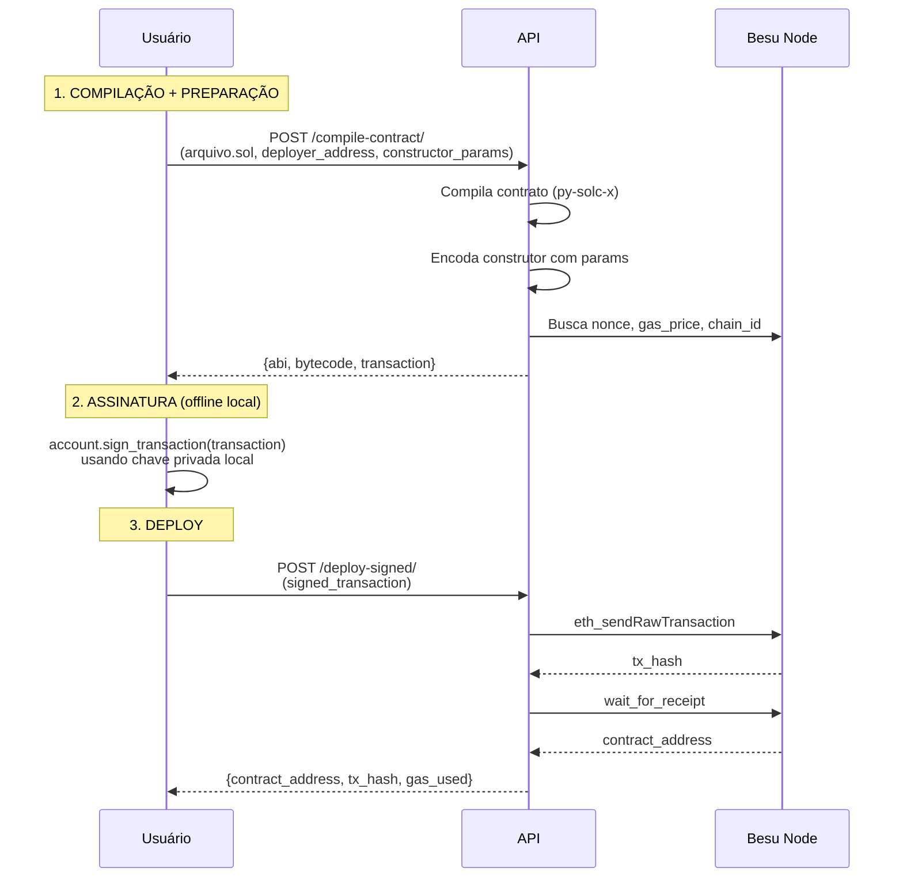

# Workflow: Compilar e Assinar Transação

## 📋 Visão Geral

A rota `/compile-contract/` foi modificada para retornar o **objeto `transaction` completo** para o usuário assinar localmente, garantindo que a chave privada **nunca** trafegue na rede.

---

## 🔄 Fluxo Completo



---

## 📝 Passo 1: Compilar e Preparar Transação

### **Request - Postman**

```http
POST https://localhost/api/v1/besu/compile-contract/
```

**Headers:**
```
Authorization: Bearer <seu_jwt_token>
```

**Body (form-data):**
```
contract_file: [arquivo SimpleStorage.sol]
deployer_address: 0xfe3b557e8fb62b89f4916b721be55ceb828dbd73
constructor_params: [42]
gas_limit: 3000000
```

### **Response**

```json
{
  "success": true,
  "abi": [
    {
      "inputs": [
        {
          "internalType": "uint256",
          "name": "_initialValue",
          "type": "uint256"
        }
      ],
      "stateMutability": "nonpayable",
      "type": "constructor"
    },
    ...
  ],
  "bytecode": "0x608060405234801561001057600080fd5b50...",
  "transaction": {
    "from": "0xfe3b557e8fb62b89f4916b721be55ceb828dbd73",
    "nonce": 5,
    "gas": 3000000,
    "gasPrice": 1000,
    "data": "0x608060405234801561001057600080fd5b50...0000002a",
    "chainId": 1337,
    "value": 0
  },
  "instructions": "Transação preparada! Próximos passos:\n1. Assine esta transação localmente com sua chave privada usando Web3\n2. Envie a transação assinada para POST /api/v1/besu/deploy-signed/\n3. Sua chave privada NUNCA deve ser enviada para a API!"
}
```

---

## 🔐 Passo 2: Assinar Transação Localmente

### **Opção A: Python Script**

Salve o script abaixo como `sign_from_api.py`:

```python
from web3 import Web3
from eth_account import Account
import json

# Cole aqui o objeto 'transaction' que a API retornou
TRANSACTION = {
    "from": "0xfe3b557e8fb62b89f4916b721be55ceb828dbd73",
    "nonce": 5,
    "gas": 3000000,
    "gasPrice": 1000,
    "data": "0x608060405234801561001057600080fd5b50...0000002a",
    "chainId": 1337,
    "value": 0
}

# Sua chave privada (NUNCA compartilhe!)
PRIVATE_KEY = "0x8f2a55949038a9610f50fb23b5883af3b4ecb3c3bb792cbcefbd1542c692be63"

# Criar conta
account = Account.from_key(PRIVATE_KEY)

print(f"Assinando transação para: {account.address}")

# Assinar transação
signed = account.sign_transaction(TRANSACTION)
signed_tx_hex = signed.raw_transaction.hex()

print("\n" + "="*70)
print("TRANSAÇÃO ASSINADA:")
print("="*70)
print(signed_tx_hex)
print("\n")

# Salvar em arquivo
output = {
    "signed_transaction": signed_tx_hex
}

with open('signed_transaction.json', 'w') as f:
    json.dump(output, f, indent=2)

print("✅ Salvo em: signed_transaction.json")
print("\nAgora envie para: POST /api/v1/besu/deploy-signed/")
```

Execute:
```bash
python sign_from_api.py
```

### **Opção B: JavaScript (Node.js)**

```javascript
const Web3 = require('web3');

// Cole aqui o objeto 'transaction' que a API retornou
const transaction = {
    from: "0xfe3b557e8fb62b89f4916b721be55ceb828dbd73",
    nonce: 5,
    gas: 3000000,
    gasPrice: 1000,
    data: "0x608060405234801561001057600080fd5b50...0000002a",
    chainId: 1337,
    value: 0
};

// Sua chave privada (NUNCA compartilhe!)
const privateKey = "0x8f2a55949038a9610f50fb23b5883af3b4ecb3c3bb792cbcefbd1542c692be63";

const web3 = new Web3();
const account = web3.eth.accounts.privateKeyToAccount(privateKey);

console.log(`Assinando transação para: ${account.address}`);

// Assinar transação
account.signTransaction(transaction).then(signed => {
    console.log("\n" + "=".repeat(70));
    console.log("TRANSAÇÃO ASSINADA:");
    console.log("=".repeat(70));
    console.log(signed.rawTransaction);
    
    console.log("\nAgora envie para: POST /api/v1/besu/deploy-signed/");
});
```

---

## 🚀 Passo 3: Fazer Deploy

### **Request - Postman**

```http
POST https://localhost/api/v1/besu/deploy-signed/
```

**Headers:**
```
Authorization: Bearer <seu_jwt_token>
Content-Type: application/json
```

**Body (raw JSON):**
```json
{
  "signed_transaction": "0xf9028c05820...assinada_completa"
}
```

### **Response**

```json
{
  "success": true,
  "contract_address": "0x1234567890abcdef1234567890abcdef12345678",
  "transaction_hash": "0xabcdef1234567890abcdef1234567890abcdef1234567890abcdef1234567890",
  "gas_used": 285123
}
```

---

## 📌 Parâmetros Importantes

### **deployer_address**
- Endereço **público** da conta que fará o deploy
- Formato: `0x...` (42 caracteres)
- ❌ **NÃO é a chave privada!**
- Exemplo: `0xfe3b557e8fb62b89f4916b721be55ceb828dbd73`

### **constructor_params**
- Array JSON com os parâmetros do construtor
- Exemplos:
  - Sem parâmetros: `[]`
  - Um número: `[42]`
  - String e número: `["TokenName", 1000]`
  - Endereço: `["0x1234..."]`

### **gas_limit**
- Quantidade máxima de gas permitido
- Padrão: `3000000` (3 milhões)
- Ajuste se necessário para contratos grandes

---

## 🔒 Segurança

### ✅ **O que a API vê:**
- Arquivo `.sol` (código público)
- Endereço público do deployer
- Parâmetros do construtor
- Transação **assinada** (não consegue extrair a chave privada)

### ❌ **O que a API NUNCA vê:**
- Chave privada (fica apenas no seu computador)
- Processo de assinatura (feito localmente)

### 🎯 **Por que é seguro?**
A assinatura criptográfica é **one-way** (unidirecional):
```
Chave Privada + Transaction → Transação Assinada ✅
Transação Assinada → Chave Privada ❌ (impossível!)
```

---

## ⚠️ Erros Comuns

### Erro 403: "Acesso negado"
```json
{
  "detail": "Acesso negado. Apenas administradores podem compilar contratos"
}
```
**Solução:** Certifique-se de que seu usuário tem `is_admin=True` no banco de dados.

### Erro: "deployer_address inválido"
```json
{
  "success": false,
  "error_message": "deployer_address inválido. Deve começar com 0x"
}
```
**Solução:** Endereço deve estar no formato `0x...` (com o prefixo 0x).

### Erro: "constructor_params deve ser um array JSON"
```json
{
  "success": false,
  "error_message": "constructor_params deve ser um array JSON. Ex: [42] ou []"
}
```
**Solução:** Envie um array JSON válido, mesmo que vazio: `[]`

---

## 💡 Dicas

1. **Teste com contratos simples primeiro** (como SimpleStorage)
2. **Verifique o nonce** se a transação falhar (pode estar desatualizado)
3. **Salve o ABI** retornado - você vai precisar para interagir com o contrato depois
4. **Guarde o contract_address** - é o endereço do seu contrato deployado

---

## 📚 Referências

- [Documentação Web3.py](https://web3py.readthedocs.io/)
- [Eth Account](https://eth-account.readthedocs.io/)
- [Ethereum Transaction Structure](https://ethereum.org/en/developers/docs/transactions/)
